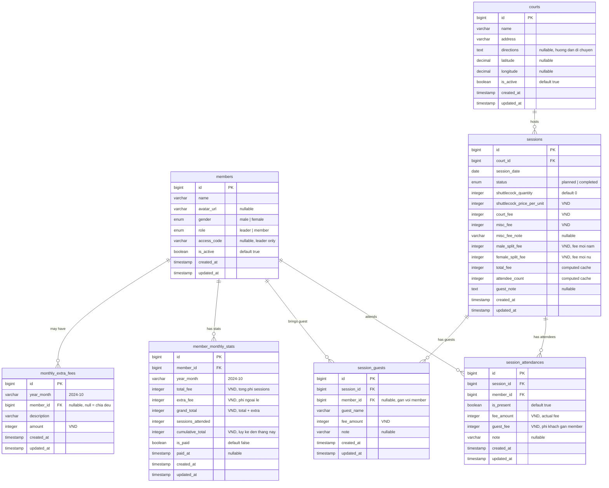

# Database Design — The Kinetic Court

## Type

SQL (PostgreSQL recommended) — quan hệ phức tạp giữa members/sessions/fees, cần ACID cho tính toán tiền.

## ERD

## Tables

### 1. `members` — Thanh vien team

| Column | Type | Constraints | Description |
|--------|------|-------------|-------------|
| id | bigint | PK, auto increment | |
| name | varchar(100) | not null | Ten thanh vien |
| avatar_url | varchar(255) | nullable | URL avatar |
| gender | enum('male','female') | not null | De chia phi nam/nu |
| role | enum('leader','member') | not null, default 'member' | |
| access_code | varchar(50) | nullable | Chi leader dung de login |
| is_active | boolean | not null, default true | Soft disable |
| created_at | timestamp | not null | |
| updated_at | timestamp | not null | |

### 2. `courts` — San cau long

| Column | Type | Constraints | Description |
|--------|------|-------------|-------------|
| id | bigint | PK, auto increment | |
| name | varchar(100) | not null | Ten san |
| address | varchar(255) | not null | Dia chi |
| directions | text | nullable | Huong dan di chuyen (text) |
| latitude | decimal(10,7) | nullable | Vi do (cho ban do) |
| longitude | decimal(10,7) | nullable | Kinh do (cho ban do) |
| is_active | boolean | not null, default true | |
| created_at | timestamp | not null | |
| updated_at | timestamp | not null | |

### 3. `sessions` — Buoi sinh hoat

| Column | Type | Constraints | Description |
|--------|------|-------------|-------------|
| id | bigint | PK, auto increment | |
| court_id | bigint | FK → courts.id, not null | San choi |
| session_date | date | not null | Ngay sinh hoat |
| status | enum('planned','completed') | not null, default 'planned' | |
| shuttlecock_quantity | integer | not null, default 0 | So luong cau su dung |
| shuttlecock_price_per_unit | integer | not null, default 0 | Don gia cau (VND) |
| court_fee | integer | not null, default 0 | Tien san (VND) |
| misc_fee | integer | not null, default 0 | Tien phat sinh (VND) |
| misc_fee_note | varchar(255) | nullable | Ghi chu phat sinh |
| male_split_fee | integer | not null, default 0 | Phi chia cho nam (VND) |
| female_split_fee | integer | not null, default 0 | Phi chia cho nu (VND) |
| total_fee | integer | not null, default 0 | Cache: tong chi phi buoi |
| attendee_count | integer | not null, default 0 | Cache: so nguoi tham gia |
| guest_note | text | nullable | Ghi chep khach chung |
| created_at | timestamp | not null | |
| updated_at | timestamp | not null | |

**Computed**: `total_fee = (shuttlecock_quantity × shuttlecock_price_per_unit) + court_fee + misc_fee`

### 4. `session_attendances` — Diem danh + phi member

| Column | Type | Constraints | Description |
|--------|------|-------------|-------------|
| id | bigint | PK, auto increment | |
| session_id | bigint | FK → sessions.id, not null | |
| member_id | bigint | FK → members.id, not null | |
| is_present | boolean | not null, default true | Toggle on/off (boi xam) |
| fee_amount | integer | not null, default 0 | Phi thuc te member tra (VND) |
| guest_fee | integer | not null, default 0 | Phi khach gan voi member (VND) |
| note | varchar(255) | nullable | |
| created_at | timestamp | not null | |
| updated_at | timestamp | not null | |

**Unique**: `(session_id, member_id)`

### 5. `session_guests` — Khach vang lai

| Column | Type | Constraints | Description |
|--------|------|-------------|-------------|
| id | bigint | PK, auto increment | |
| session_id | bigint | FK → sessions.id, not null | |
| member_id | bigint | FK → members.id, nullable | Neu gan voi member |
| guest_name | varchar(100) | not null | Ten khach |
| fee_amount | integer | not null, default 0 | Phi khach (VND) |
| note | varchar(255) | nullable | |
| created_at | timestamp | not null | |
| updated_at | timestamp | not null | |

**Logic**: Khi `member_id` != null → `fee_amount` duoc cong vao `session_attendances.guest_fee` cua member do.

### 6. `monthly_extra_fees` — Khoan ngoai le theo thang

| Column | Type | Constraints | Description |
|--------|------|-------------|-------------|
| id | bigint | PK, auto increment | |
| year_month | varchar(7) | not null | Format: "2024-10" |
| member_id | bigint | FK → members.id, nullable | null = ap dung chia deu |
| description | varchar(255) | not null | Mo ta khoan phi |
| amount | integer | not null | So tien (VND) |
| created_at | timestamp | not null | |
| updated_at | timestamp | not null | |

### 7. `member_monthly_stats` — Cache thong ke thang

| Column | Type | Constraints | Description |
|--------|------|-------------|-------------|
| id | bigint | PK, auto increment | |
| member_id | bigint | FK → members.id, not null | |
| year_month | varchar(7) | not null | Format: "2024-10" |
| total_fee | integer | not null, default 0 | Tong phi sessions (VND) |
| extra_fee | integer | not null, default 0 | Phi ngoai le (VND) |
| grand_total | integer | not null, default 0 | total_fee + extra_fee |
| sessions_attended | integer | not null, default 0 | So buoi tham gia |
| cumulative_total | integer | not null, default 0 | Luy ke den thang nay (VND) |
| is_paid | boolean | not null, default false | Da thanh toan chua |
| paid_at | timestamp | nullable | Thoi diem thanh toan |
| created_at | timestamp | not null | |
| updated_at | timestamp | not null | |

**Unique**: `(member_id, year_month)`

**Recalculate trigger**: Khi session data thay doi → recalculate stats cho thang tuong ung.

## Indexes

| Index | Table | Columns | Type |
|-------|-------|---------|------|
| `idx_sessions_date` | sessions | session_date | btree |
| `idx_sessions_court` | sessions | court_id | btree |
| `uniq_attendances` | session_attendances | session_id, member_id | unique |
| `idx_attendances_session` | session_attendances | session_id | btree |
| `idx_attendances_member` | session_attendances | member_id | btree |
| `idx_guests_session` | session_guests | session_id | btree |
| `idx_guests_member` | session_guests | member_id | btree |
| `uniq_stats` | member_monthly_stats | member_id, year_month | unique |
| `idx_extra_fees_month` | monthly_extra_fees | year_month | btree |

## Migration Order

1. `create_members` — independent
2. `create_courts` — independent
3. `create_sessions` — depends on courts
4. `create_session_attendances` — depends on sessions, members
5. `create_session_guests` — depends on sessions, members
6. `create_monthly_extra_fees` — depends on members
7. `create_member_monthly_stats` — depends on members

## Notes

- **VND dung integer**: VND khong co xu, integer tranh floating point errors. 70000 = 70.000d
- **Stats recalculation**: Khi leader save session → app recalculate `member_monthly_stats` cho thang do (application-level, khong dung DB trigger)
- **Cumulative total**: SUM(grand_total) tu thang dau tien → thang hien tai, cache trong `cumulative_total` de My Page load nhanh
- **Guest fee transparency**: `session_guests.fee_amount` + `session_attendances.guest_fee` dam bao hien thi ro: "phi ca nhan: 70k + phi khach: 70k = 140k"
- **Soft delete**: Dung `is_active = false` thay vi xoa, giu nguyen data lich su
